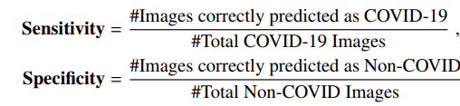
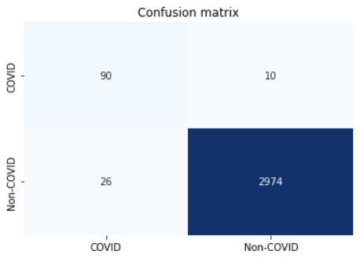
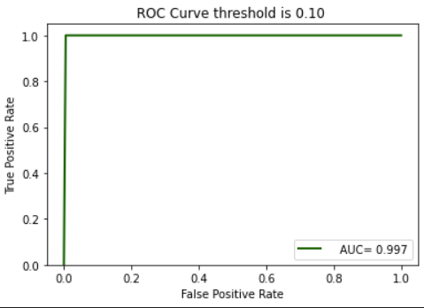

# COVID Detection
In this project we aimed to predict if there exist any effect of COVID in someone's chest. The dataset consists of chest images showing if that image is infected by COVID virus or not[dataset link](https://www.dropbox.com/s/9w8nmj791c9ogsx/data_upload_v3.zip?dl=0).

## Data Augmentation
I applied some kind of transformation on images to augment data. some of them are 
* Random Rotation
* Random Horizontal FLip
* Gaussian Blur

## Training Phase
At first, I prepared data loader for loading image in a batch model. Then as our pretrained model SqueezeNet was picked to load weights from it. I freezed the whole layers of this Network. then add Convolution 2d Layer and adaptive pooling and fine-tuning happens on this layer.

## evaluation 
for evaluation, we picked 2 criterion senivity and creativity based on [this paper](https://paperswithcode.com/paper/deep-covid-predicting-covid-19-from-chest-x) and we also plotted confusion matrix and ROC curve for different thresholds.

## Result

